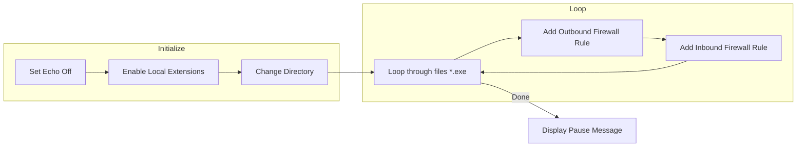

# Block Programs from Internet using Firewall

This script helps you block internet access for specific programs using the Windows firewall automatically.

## What it does
- The script blocks internet access for all `.exe` files in the script's directory and its subfolders.
- It creates two firewall rules for each `.exe` file found: one for incoming connections and one for outgoing connections.

## How to use
1. Download this repository.
2. Extract the downloaded files.
3. Copy the extracted `.bat` file to the folder of the program(s) you want to block internet access for.
4. Run the script as an administrator (right-click on the script and choose "Run as administrator").
5. Once the script finishes running, you can safely delete the `.bat` file from the program folder.
6. Internet access for the specified programs will now be blocked.

## How it works
- The script is written in `batch` language, a scripting language for the Windows command line.
- It uses the `for` and `netsh` commands to add firewall rules for each `.exe` file in the current directory and its subdirectories.
- The `for /R` command searches through all subdirectories, and `%%f` represents the current file path.
- Firewall rules are added using the `netsh advfirewall firewall add rule` command.
- Each rule blocks incoming and outgoing connections for a specific program.
- The rule's name, direction, and program path are specified in the command.
- The script includes the `setlocal enableextensions` command to enable extensions and `cd /d "%~dp0"` to change to the script's directory.
- A `pause` command is included so you can review the results before closing the command prompt.

## Flowchart

Note: Be cautious when using this script, as it blocks all internet access for the specified programs. Make sure to have backup copies of the files you want to block.
